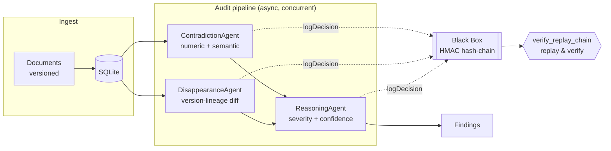

<div align="center">
<pre>

 █████╗ ██╗   ██╗██████╗ ██╗████████╗ ██████╗ ██████╗     ███████╗███████╗██████╗  ██████╗ 
██╔══██╗██║   ██║██╔══██╗██║╚══██╔══╝██╔═══██╗██╔══██╗    ╚══███╔╝██╔════╝██╔══██╗██╔═══██╗
███████║██║   ██║██║  ██║██║   ██║   ██║   ██║██████╔╝      ███╔╝ █████╗  ██████╔╝██║   ██║
██╔══██║██║   ██║██║  ██║██║   ██║   ██║   ██║██╔══██╗     ███╔╝  ██╔══╝  ██╔══██╗██║   ██║
██║  ██║╚██████╔╝██████╔╝██║   ██║   ╚██████╔╝██║  ██║    ███████╗███████╗██║  ██║╚██████╔╝
╚═╝  ╚═╝ ╚═════╝ ╚═════╝ ╚═╝   ╚═╝    ╚═════╝ ╚═╝  ╚═╝    ╚══════╝╚══════╝╚═╝  ╚═╝ ╚═════╝ 

</pre>

**NitroStack Hackathon · Enterprise AI & Workplace Automation Track**

*Every contradiction. Every silent omission. Sealed in a tamper-proof, cryptographically keyed decision ledger — and replayable, step by step, on demand.*

[](https://www.typescriptlang.org/)
[](https://nitrostack.ai)
[](https://modelcontextprotocol.io/)
[](https://www.anthropic.com/)
[](./LICENSE)

**[Live Demo](#getting-started)** · **[Architecture](#how-it-works)** · **[The Black Box](#the-black-box--a-cryptographically-keyed-decision-ledger)** · **[API Reference](#api)**

</div>

---

## The Problem

> *"The 2025 filing quietly dropped last year's risk disclosure about supplier concentration. Nobody caught it — until the quarter it mattered."*

This is the story behind every silent disclosure failure, and it is structurally invisible to every document tool built today. Search answers *"what does this say."* It cannot answer *"what did this used to say, and why did it stop"* — or *"what does this say that our own other policy quietly contradicts."*

| Pain Point | What It Costs |
|---|---|
| **Manual cross-document review** | Compliance teams read filings sequentially, once a quarter — contradictions and omissions between documents are invisible by construction |
| **No memory across versions** | A risk factor, a security obligation, a disclosed commitment can vanish between one version and the next with nobody noticing until it's already too late |
| **No traceable reasoning** | When an AI tool *does* flag something, nobody can verify — to a skeptical auditor or a court — exactly how it reached that conclusion, or whether the record was altered afterward |

**Auditor Zero** closes this gap — autonomously, with every finding sealed in a cryptographic ledger that can be replayed and verified on demand.

---

## What Makes It Different — In One Sentence

> *Every other AI review tool asks you to trust its output. Auditor Zero shows you the receipts — cryptographically, for every single decision it made.*

---

## Highlights

| | |
|---|---|
| 🔎 **Four complementary detectors** | Deterministic numeric-conflict detection, LLM-driven semantic comparison, cross-version change detection, and category-disappearance detection — each finding tagged with *how* it was found, so nothing is a black box to the user |
| 🔐 **Cryptographically keyed provenance** | `HMAC-SHA256(secret, prevHash + payload)` per decision step. The chain is *keyed*, not just hashed — an attacker who edits a stored record cannot re-seal the chain without the server's secret. **Tamper-proof, not merely tamper-evident.** |
| ⚡ **Non-blocking, live-progress audits** | Analysis runs asynchronously with bounded concurrency; findings stream into the UI as they're discovered, not after a long wait |
| 🧭 **Explainable by design** | Every judgment ships with its reasoning, visibly — nothing is a bare confidence score with no justification |
| 🧩 **One source of truth, two protocols** | Every operation is defined once and exposed identically as both an **MCP tool** and a **REST endpoint** — build for agents and humans from the same code |
| 🖥️ **A real product, not a script** | Full auth, a modular dashboard, one-click demo seeding, a replay drawer, live integrity verification, and light/dark themes |

---

## What Makes This Actually Trustworthy

Most "AI audit" tools are a single LLM call with a confidence score bolted on — the user is still asked to just believe it. Auditor Zero's trust model is architectural, not cosmetic.

**1 · The Chain Is Keyed, Not Just Hashed**
A plain hash chain only proves *something* was recorded in order — anyone who edits a record can simply recompute a new, internally-consistent chain from that point forward. Auditor Zero's chain is sealed with `HMAC-SHA256` under a server-held secret. Without that secret, no forged chain will ever reproduce the stored hashes. This is the difference between *"we kept a log"* and *"we can cryptographically prove this reasoning was never altered."*

**2 · Every Finding Is Independently Replayable**
`verify_replay_chain` doesn't trust its own stored state — it recomputes every link from `GENESIS` forward and reports the exact record where the chain breaks, if it ever does. Nothing is taken on faith, including the system's own prior output.

**3 · Detection Is Layered, Not Single-Shot**
Deterministic numeric-conflict detection runs independently of the LLM's semantic judgment — a cheap, fast pre-filter that catches hard numeric contradictions (`90 days` vs. `180 days`) even in cases where negation-word matching alone would miss them entirely. The system doesn't rely on a single method to be right.

**4 · Nothing Is a Bare Score**
Every severity and confidence rating ships with the reasoning that produced it. A judge, an auditor, or a compliance officer never has to take a number on faith — they can read exactly why the system decided what it decided.

---

## How it works



Documents are grouped into **version lineages** ordered by a monotonic ingestion sequence — not by parsing version strings — so `v1/v2` vs. `1.0/1.10` can never silently break a diff. Within a lineage, consecutive versions are compared: a category that's vanished entirely becomes a **disappearance**; a materially changed obligation becomes a **cross-version contradiction**. Across different documents, obligation clauses are compared pairwise. Findings are deduplicated by a per-audit signature, so the same underlying issue is surfaced once — never spammed across multiple detectors.

### Detection methods

| Method | Kind | How it fires |
|---|---|---|
| **Numeric conflict** | deterministic | Two topically related clauses assert different values for the same unit (days, hours, %, $) — catches `90 days` vs. `180 days` even with zero negation words |
| **Semantic (LLM)** | model-driven | Two obligation clauses from different documents are judged contradictory, gated by a topic-overlap check so unrelated clauses are never wastefully compared |
| **Cross-version change** | model-driven | An obligation still present in the new version but materially weakened (e.g. VPN *"required"* → *"optional"*) |
| **Category removed** | model-driven | An entire obligation category present in an older version is completely absent from the newer one |

---

## The Black Box — a cryptographically keyed decision ledger

This is the part nobody else has built.

Every agent step calls `logDecision({ auditId, agentName, input, output })`, which:

1. Reads the hash of the last ledger entry for that audit — `"GENESIS"` if this is the first
2. Computes `hash = HMAC-SHA256(LEDGER_SECRET, prevHash + JSON.stringify({ agentName, input, output, timestamp }))`
3. Appends the record to `decision_records`, keyed by a monotonic sequence per audit

`verify_replay_chain` recomputes every link from `GENESIS` forward using the server-held key, and returns `verified: false` plus the exact `brokenAt` index the moment a stored hash doesn't match. Because the chain is **keyed** (HMAC, not a plain hash), an attacker cannot simply recompute a fresh, valid-looking chain after editing a record — without the secret, no forged chain will ever verify. This is the difference between "we kept a log" and **"we can cryptographically prove this reasoning chain was never altered."**

Try it yourself: load the demo data, run an audit, open a finding → **Replay → Verify integrity**. Then flip on **Dev tools**, tamper a record, and watch verification catch it — and tell you exactly where the chain broke.

---

## Built on NitroStack

Auditor Zero is architected end-to-end on **NitroStack's** agent and MCP tooling — every audit operation (ingestion, contradiction detection, disappearance detection, severity scoring, replay, verification) is defined once as a NitroStack tool and exposed identically to both human users (REST + web dashboard) and AI orchestrators (MCP stdio server), so the same reasoning pipeline any human clicks through in the dashboard is exactly what an autonomous agent calls under the hood.

---

## Tech stack

**TypeScript** · **Express** (REST) · **@modelcontextprotocol/sdk** (MCP stdio server) · **@anthropic-ai/sdk** (LLM reasoning) · **better-sqlite3** · **Zod** (schema validation) · **JWT + bcrypt** (auth) · **React 18 + esbuild** (web app) · **Vitest** (tests)

---

## Getting started

### Prerequisites

- Node.js ≥ 18
- An Anthropic API key ([console.anthropic.com](https://console.anthropic.com))

### Setup

```bash
git clone https://github.com/ChallapalliSathwik/auditor-zero.git
cd auditor-zero
npm install

cp .env.example .env        # fill in ANTHROPIC_API_KEY, JWT_SECRET, LEDGER_SECRET
npm run seed                # seed the built-in demo policy set (optional)
npm run build:web           # bundle the web app into public/
npm run dev                 # start the API + web app on http://localhost:8080
```

Open **http://localhost:8080**, create an account, click **Load demo data → Run audit**, open a finding, and hit **Replay → Verify integrity**. Toggle **Dev tools** to tamper a record and watch verification catch it in real time.

### Other commands

```bash
npm run mcp        # run the MCP stdio server (for MCP-aware clients/orchestrators)
npm test           # run the test suite (Vitest)
npm run typecheck  # type-check without emitting
npm run build      # tsc + web bundle
npm start          # build then run the compiled server
```

### Docker

```bash
cp .env.example .env    # fill in real values
docker compose up --build
```

---

## Configuration

| Variable | Required | Description |
|---|---|---|
| `ANTHROPIC_API_KEY` | ✅ | Powers semantic detection and severity scoring |
| `JWT_SECRET` | ✅ | Signs auth tokens; also the fallback ledger key if `LEDGER_SECRET` is unset |
| `LEDGER_SECRET` | recommended | The HMAC key that seals the Black Box — held only by the server |
| `ANTHROPIC_MODEL` | – | Model id (default `claude-sonnet-4-6`) |
| `PORT` | – | API port (default `8080`) |
| `DATABASE_PATH` | – | SQLite file path (default `./data/auditor-zero.db`) |
| `JWT_EXPIRES_IN` | – | Token lifetime (default `8h`) |
| `ALLOW_TAMPER_DEMO` | – | Enables the dev-only tamper endpoint when `NODE_ENV=production` — keep `false` in real deployments |

---

## API

All `/api/*` routes except `auth` and `health` require `Authorization: Bearer <token>`.

| Method & path | Description |
|---|---|
| `POST /api/auth/signup` · `POST /api/auth/login` | Get a JWT |
| `GET /api/health` | Liveness check |
| `POST /api/docs` | Ingest a document (optional `previousDocumentId` to link a version lineage) |
| `GET /api/docs` | List documents |
| `POST /api/demo/seed` | Ingest the built-in demo document set |
| `POST /api/audits` | Start an audit — returns immediately, poll for progress |
| `GET /api/audits` · `GET /api/audits/:id` | List audits / fetch one with findings and live progress |
| `GET /api/audits/:id/trail` | The sealed decision ledger (read-only) |
| `GET /api/audits/:id/verify` | Recompute and verify the keyed hash chain |
| `POST /api/tamper` | **Dev only** — edit a record in place to demo tamper detection |

The same operations are exposed identically as MCP tools: `ingest_document`, `list_documents`, `seed_demo_documents`, `analyze_document`, `get_audit_result`, `list_audits`, `get_decision_trail`, `verify_replay_chain`, `debug_tamper_record`.

---

## Project structure

```
src/
  server.ts                     # Express REST API (auth + tool-backed endpoints)
  db/
    index.ts                    # SQLite schema + lightweight migrations
    demo-docs.ts                # Shared demo document set (CLI seed + one-click UI seed)
    seed.ts                     # CLI seeder
  auth/auth.service.ts          # JWT signup/login, requireAuth/requireRole
  lib/llm.ts                    # Anthropic client wrapper (complete / completeJSON)
  modules/audit/
    types.ts                    # Doc, Finding, Audit, DecisionRecord, ReplayResult
    audit.service.ts            # Detection engine + async orchestration + dedupe
    blackbox.service.ts         # HMAC hash-chain ledger + verify
  mcp/
    tools.ts                    # Tool definitions (Zod schema + handler) — single source of truth
    server.ts                   # MCP stdio server
  widgets/app/audit-results/
    page.tsx                    # Web app entry
    ui/                         # Modular design system, api client, components, views
tests/                          # Black-box chain, ingestion, and auth tests
```

---

## Roadmap

- Embedding-based candidate selection to replace O(n²) clause pairing for large corpora
- External anchoring of each audit's root hash (e.g. signed and published) for third-party verifiability
- A labelled evaluation harness to measure detector precision/recall over time

---

## At a Glance

| Metric | Value |
|---|---|
| Detection methods per audit | **4** — numeric, semantic (LLM), cross-version, category-removed |
| Decision ledger integrity | **Cryptographically keyed** (HMAC-SHA256) — verifiable end-to-end from `GENESIS` |
| Human judgment required to trust a finding | **Zero** — every step is replayable and independently verifiable |
| Interfaces exposed per operation | **2** — identical MCP tool and REST endpoint, one source of truth |

---

## Team

Built in 24 hours by:

| Name | GitHub Username |
|---|---|
| Madhumita Shenbagarajesh | `@Madhumita-05` |
| Hema M | `@Hemashankar19` |
| Challapalli Sathwik | `@ChallapalliSathwik` |
| Shobhana S | `@Shobhanashankar` |

---

<div align="center">

**AUDITOR ZERO · NitroStack Hackathon · BFSI & Enterprise AI Track**

*Not just another AI reading your documents. An agent that cross-examines them — and can prove, cryptographically, exactly how it knows.*

**[MIT License](./LICENSE)**

</div>
