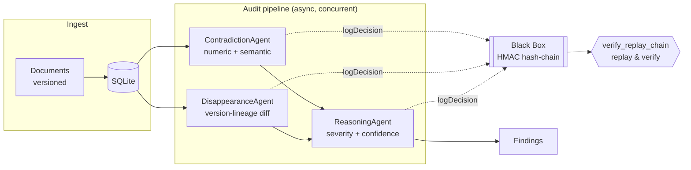

<div align="center">


### AI document auditing you can actually trust — every finding is replayable and sealed in a tamper-proof, cryptographically keyed decision ledger.

[](https://www.typescriptlang.org/)
[](https://nodejs.org/)
[](https://expressjs.com/)
[](https://modelcontextprotocol.io/)
[](./LICENSE)

</div>

---

## Overview

**Auditor Zero** ingests versioned policy and contract documents and finds two classes of problems that are easy to miss and expensive to get wrong:

- **Contradictions** — obligations that conflict, whether across two different documents or between versions of the same one (e.g. one policy requires full-disk encryption while another makes it optional; a password-rotation window silently changes from 90 to 180 days).
- **Disappearances** — an obligation, risk factor, or commitment that was present in an older version and has **vanished entirely** from a newer one.

The differentiator is trust. Most AI review tools ask you to take the model's word for it. Auditor Zero seals **every** agent step — ingestion, each comparison, each severity score — into a **Black Box**: an HMAC-keyed hash chain. Any finding can be *replayed* step by step, and the chain can be *verified*. Because it is keyed with a server-held secret, an attacker who edits a stored decision **cannot re-seal the chain to hide it**. That makes the ledger tamper-**proof**, not merely tamper-evident.

## Highlights

- 🔎 **Four complementary detectors** — deterministic numeric-conflict detection, LLM semantic comparison, cross-version change detection, and category-disappearance detection. Each finding is tagged with *how* it was found, so nothing is a black box to the user.
- 🔐 **Cryptographically keyed provenance** — `HMAC-SHA256(secret, prevHash + payload)` per step. Verify recomputes the chain from `GENESIS`; a single altered record fails verification and points to exactly where the chain broke.
- ⚡ **Non-blocking audits with live progress** — analysis runs in the background with bounded concurrency; the UI streams progress and shows findings as they land.
- 🧭 **Explainable by design** — keyword/negation matching is only a cheap pre-filter; the actual judgments and their reasoning are surfaced, never hidden behind an opaque score.
- 🧩 **One source of truth for MCP + REST** — every operation is a tool defined once and exposed identically over an MCP stdio server and a REST API.
- 🖥️ **Enterprise web app** — a modular dashboard with document management, one-click demo data, a replay drawer, integrity verification, and light/dark themes.

## How it works



Documents are grouped into **version lineages** ordered by a monotonic ingestion sequence (not by parsing version strings, so `v1/v2` vs `1.0/1.10` can't break the diff). Within a lineage, consecutive versions are diffed: a category that is gone entirely becomes a **disappearance**, while a materially changed obligation becomes a **cross-version contradiction**. Across different documents, obligation clauses are compared pairwise. Findings are deduplicated by a per-audit signature so the same underlying issue is reported once, even when several clause pairs or detectors surface it.

### Detection methods

| Method | Kind | How it fires |
|---|---|---|
| **Numeric conflict** | deterministic | Two topically-related clauses assert different values for the same unit (days, hours, %, $). Catches `90 days` vs `180 days` even with no negation words. |
| **Semantic (LLM)** | model | Two obligation clauses from different documents are judged contradictory, gated by a topic-overlap check so unrelated clauses are never compared. |
| **Cross-version change** | model | An obligation still present in the new version but materially weakened/altered (e.g. VPN "required" → "optional"). |
| **Category removed** | model | An obligation category present in an older version is entirely absent from the newer one. |

## The Black Box (keyed decision ledger)

Every agent step calls `logDecision({ auditId, agentName, input, output })`, which:

1. Reads the hash of the last ledger entry for that audit (`"GENESIS"` if none).
2. Computes `hash = HMAC-SHA256(LEDGER_SECRET, prevHash + JSON.stringify({ agentName, input, output, timestamp }))`.
3. Appends the record to `decision_records`, keyed by a monotonic `seq` per audit.

`verify_replay_chain` recomputes every link from `GENESIS` forward with the key and returns `verified: false` plus `brokenAt` at the first record whose stored hash doesn't match. Because the chain is keyed, recomputing a valid chain after an edit is infeasible without the secret — verified end-to-end: the real key reproduces every stored hash, a wrong key reproduces none.

## Tech stack

**TypeScript** · **Express** (REST) · **@modelcontextprotocol/sdk** (MCP stdio server) · **@anthropic-ai/sdk** (LLM) · **better-sqlite3** · **Zod** · **JWT + bcrypt** (auth) · **React 18** + **esbuild** (web app) · **Vitest** (tests).

## Getting started

### Prerequisites

- Node.js ≥ 18
- An Anthropic API key ([console.anthropic.com](https://console.anthropic.com))

### Setup

```bash
git clone https://github.com/ChallapalliSathwik/auditor-zero.git
cd auditor-zero
npm install

cp .env.example .env        # then fill in ANTHROPIC_API_KEY, JWT_SECRET, LEDGER_SECRET
npm run seed                # seed the built-in demo policy set (optional)
npm run build:web           # bundle the web app into public/
npm run dev                 # start the API + web app on http://localhost:8080
```

Open **http://localhost:8080**, create an account (or use the demo flow), click **Load demo data → Run audit**, then open a finding and hit **Replay → Verify integrity**. Toggle **Dev tools** to tamper a record and watch verification catch it.

### Other commands

```bash
npm run mcp        # run the MCP stdio server (for MCP-aware clients/orchestrators)
npm test           # run the test suite (Vitest)
npm run typecheck  # type-check without emitting
npm run build      # tsc + web bundle
npm start          # build then run the compiled server
```

### Docker

```bash
cp .env.example .env    # fill in real values
docker compose up --build
```

## Configuration

| Variable | Required | Description |
|---|---|---|
| `ANTHROPIC_API_KEY` | ✅ | Key for semantic detection and severity scoring. |
| `JWT_SECRET` | ✅ | Signs auth tokens. Also the fallback ledger key if `LEDGER_SECRET` is unset. |
| `LEDGER_SECRET` | recommended | HMAC key that seals the Black Box. Held only by the server. |
| `ANTHROPIC_MODEL` | – | Model id (default `claude-sonnet-4-6`). |
| `PORT` | – | API port (default `8080`). |
| `DATABASE_PATH` | – | SQLite file path (default `./data/auditor-zero.db`). |
| `JWT_EXPIRES_IN` | – | Token lifetime (default `8h`). |
| `ALLOW_TAMPER_DEMO` | – | Allows the dev-only tamper endpoint when `NODE_ENV=production`. Keep `false` in real deployments. |

## API

All `/api/*` routes except `auth` and `health` require `Authorization: Bearer <token>`.

| Method & path | Description |
|---|---|
| `POST /api/auth/signup` · `POST /api/auth/login` | Get a JWT. |
| `GET /api/health` | Liveness. |
| `POST /api/docs` | Ingest a document (optional `previousDocumentId`). |
| `GET /api/docs` | List documents. |
| `POST /api/demo/seed` | Ingest the built-in demo document set. |
| `POST /api/audits` | Start an audit (returns immediately; poll for progress). |
| `GET /api/audits` · `GET /api/audits/:id` | List audits / fetch one with findings and live progress. |
| `GET /api/audits/:id/trail` | The sealed decision ledger (read-only). |
| `GET /api/audits/:id/verify` | Recompute and verify the keyed chain. |
| `POST /api/tamper` | **Dev only** — edit a record in place to demo detection. |

The same operations are exposed as MCP tools: `ingest_document`, `list_documents`, `seed_demo_documents`, `analyze_document`, `get_audit_result`, `list_audits`, `get_decision_trail`, `verify_replay_chain`, `debug_tamper_record`.

## Project structure

```
src/
  server.ts                     # Express REST API (auth + tool-backed endpoints)
  db/
    index.ts                    # SQLite schema + lightweight migrations
    demo-docs.ts                # Shared demo document set (CLI seed + one-click UI seed)
    seed.ts                     # CLI seeder
  auth/auth.service.ts          # JWT signup/login, requireAuth/requireRole
  lib/llm.ts                    # Anthropic client wrapper (complete / completeJSON)
  modules/audit/
    types.ts                    # Doc, Finding, Audit, DecisionRecord, ReplayResult
    audit.service.ts            # Detection engine + async orchestration + dedupe
    blackbox.service.ts         # HMAC hash-chain ledger + verify
  mcp/
    tools.ts                    # Tool definitions (Zod schema + handler) — single source of truth
    server.ts                   # MCP stdio server
  widgets/app/audit-results/
    page.tsx                    # Web app entry
    ui/                         # Modular design system, api client, components, views
tests/                          # Black-box chain, ingestion, and auth tests
```

## Security notes

- `.env` is git-ignored; commit only `.env.example`. Never commit real keys.
- The Black Box is keyed with a server-held secret (`LEDGER_SECRET`); rotate it if exposed.
- The tamper endpoint exists purely to demonstrate detection and is disabled in production unless explicitly allowed.

## Roadmap

- Embedding-based candidate selection to replace O(n²) clause pairing for large corpora.
- External anchoring of each audit's root hash (e.g. signed and published) for third-party verifiability.
- A labelled evaluation harness to measure detector precision/recall over time.

## License

[MIT](./LICENSE) © Challapalli Sathwik
